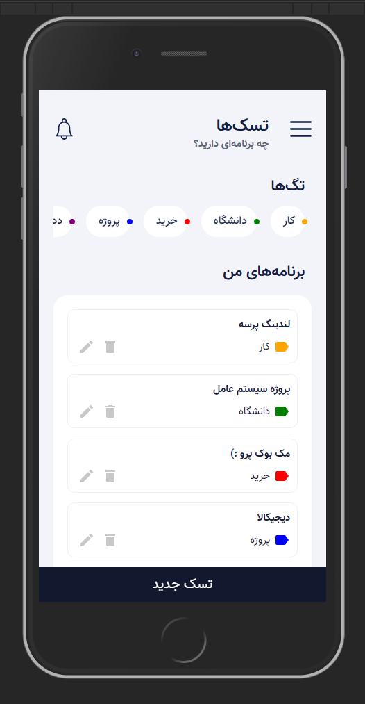

# Mern Todo App

this is a MERN Todo App. Front end is React JS and Backend technologies is EXpress, Node.js, Mongo Database.

<p align="center">
  
</p>

## Running Locally

This project was bootstrapped with [Create React App](https://github.com/facebook/create-react-app).

install [node.js](http://nodejs.org/)

and clone the repo
```
git clone https://github.com/hadizz/mern-todo-app
cd mern-todo-app
```

### Back End

go to backend folder
```
cd backend
```

*NOTE* : You can easily run `npm install` or you can follow these instructions.

we need to initialize our project with a package.json file which will contain some information about our app and the dependencies which our app needs to run.

using npm
```
npm init
```
or you can use `npm init -y` to use the default values.

now we install dependencies for backend
```
npm install express body-parser cors dotenv mongoose nodemon
```

open package.json and add this script to scripts field:
```
"dev": "npx nodemon index.js"
```
*nodemon* - Auto-refresh the server on code change

We are using Mongo DB as our database. You can Install mongodb and run mongo server or [Create a free MongoDB Atlas cluster](https://www.mongodb.com/cloud/atlas).

after that, in `backend` folder create `.env` file
```
touch .env
```

and add your database config
```
/**
 * Connection URI. Update <username>, <password>, and <your-cluster-url> to reflect your cluster.
 * See https://docs.mongodb.com/ecosystem/drivers/node/ for more details
 */
DB_CONNECTION="mongodb+srv://<username>:<password>@<your-cluster-url>/test?retryWrites=true&w=majority";
```

✔️ now you can run backend using
```
npm run dev
```


### Front End

first go to project directory `mern-todo-app`

*NOTE* : You can easily run `npm install` or you can follow these instructions.

install dependencies using npm
```
npm install
```

make sure to install [axios](https://github.com/axios/axios) using npm
```
npm install axios
```
*axios* - Promise based HTTP client for the browser and node.js

✔️ you can run the app in development mode with
```
npm run start
```

and open http://localhost:3000 to view the result in browser

### Run React-Frontend and Nodejs-Backend with one command

in `mern-todo-app` directory install concurrently
using npm
```
npm install --save-dev concurrently
```
now you can see it added to devDependencies.

here we have to add proxy to devDependencies. for example in this project my backend is using port 5000.
```
"proxy": "http://localhost:5000"
```

and add these scripts to scripts field in package.json file:
```
"client": "npm start",
"server": "cd backend && npm run dev",
"dev": "concurrently \"npm run server\" \"npm run client\""
```

✔️ now we can run our mern project using
```
npm run dev
```

## TODOS

- [x] Front end
  - [x] Create-react-app
  - [x] Create todo form
  - [x] Show todos in a list
  - [x] Change app language to persian & change direction to rtl
  - [ ] Make UI responsive and better -> working on!
- [x] Backend
  - [x] Create basic API with Express
  - [x] Create online database (https://www.mongodb.com/cloud/atlas)
  - [x] CRUD
- [ ] Connect Front to Back - need UI to be Completed
- [ ] Redux

## Resources

- Coding Garden With CJ | https://www.youtube.com/channel/UCLNgu_OupwoeESgtab33CCw
- Dev Ed | https://www.youtube.com/channel/UClb90NQQcskPUGDIXsQEz5Q
